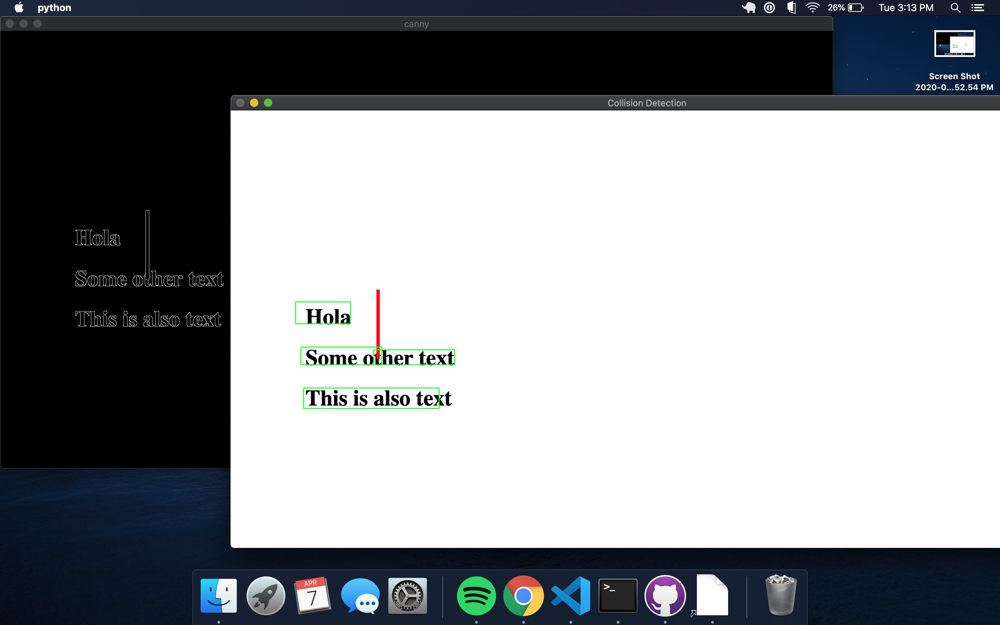

# Getting Started
1. Install Google Chrome
2. Install the proper Google Chromedriver for your installed version of Google Chrome https://chromedriver.chromium.org/downloads
3. In testing.py you will need to update `chrome_binary_path` to the location of the chromedriver you just installed
4. Run testing.py

## How It Works
1. Create boudning boxes for text using "EAST text detector"
2. Find all the long straight lines using Canny Edge Detection -> Hough Lines
3. If an intersection exists there is a possibility the text has flown outside of its containing box

## Example Collision

#### There is a collision between the text and vertical bar (actual HTML) resulting in a collision

#### NOTE: This is a demonstration project and has only been tested on 2 HTML pages
